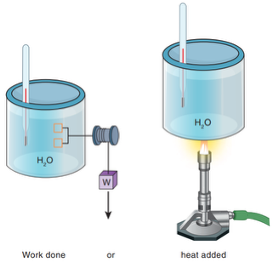
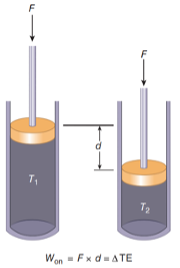

<head>

</head>

# Unit 2: Thermodynamics
In this second unit, we’ll look at our first and most basic use of energy: **heating**. To understand this, we need to learn about **thermodynamics**:

- **Thermo-** = heat  
- **-dynamics** = motion  

After we discuss thermodynamics, we talk about using heat to harness energy. In particular, we will look at the use of __fossil fuels__.

-----

# Thermal Energy
Reading:
* Textbook sections 5A–5C  

Materials:
* Adiabatic Compression device

-----

## The First Two Laws of Thermodynamics

There are four basic laws of thermodynamics. We’ll learn them over the next few days.

### Zeroth Law of Thermodynamics

If two objects are in thermal contact (energy can flow between them), then eventually they will reach **thermal equilibrium** (equal energy).

The **zeroth law of thermodynamics** states:

> If two objects are each in thermal equilibrium with a third object, then they will be in thermal equilibrium with each other.

A simpler example:

- If Block A is in thermal equilibrium with Block B  
- And Block C is also in thermal equilibrium with Block B  
- Then Block A is in thermal equilibrium with Block C  

This is a very intuitive law and almost does not need to be stated. However, this law is the reason we can use **thermometers**, and it provides the basis for the definition of **temperature**.

### First Law of Thermodynamics

The **first law of thermodynamics** states that the total energy of a system can be increased by doing work on and/or applying heat to that system.

$$W_{\text{on}} + Q_{\text{to}} = \Delta E$$

Examples:
- Pushing a shopping cart  
  - Work done **by me** is **on the shopping cart**
- Heating water  
  - Heat applied **from the flame** is **to the water**

References:
 
- *Figure 5.2:* Adding Work and Heat  
- *Figure 5.3:* Using work to increase thermal energy  

> Demo: Adiabatic Compression - using work to increase thermal energy

## Temperature

**Temperature** is a measure of the motion (average kinetic energy) of molecules.

- Hot temperatures → molecules move quickly  
- Cold temperatures → molecules move slowly  

| Reference Point                               | Fahrenheit | Celsius   | Kelvin    |
| --------------------------------------------: | :--------: | :-------: | :-------: |
| Boiling point of water                        | *212°F*    | __100°C__ | *373 K*   |
| Human body temperature                        | __~100°F__ | *37.8°C*  | *310.8 K* |
| Room temperature                              | 72°F       | *~22°C*   | *295 K*   |
| Average global temperature                    | *59°F*     | 15°C      | *288 K*   |
| Freezing point of water                       | 32°F       | __0°C__   | __273 K__ |
| Freezing point of an alcohol–saline solution  | __0°F__    | *-17.8°C* | *255.2 K* |
| Absolute zero                                 | *-460°F*   | *-273°C*  | __0 K__   |

> Provide this table with just the basis temperatures. Fill in values as we discuss them. Have students convert the numbers in italics.

### Basis of Temperature Scales

- **Fahrenheit scale:** Based on human body temperature and the freezing point of a stable saline–alcohol solution  
- **Celsius scale:** Based on the freezing and boiling points of water  

Converting Celsius to Fahrenheit:
$$T^{^\circ\text{F}} = \frac{9}{5}T^{^\circ\text{C}} + 32$$

Converting Fahrenheit to Celsius:
$$T^{^\circ\text{C}} = \frac{5}{9}(T^{^\circ\text{F}} - 32)$$

### Absolute Zero

- If temperature is a measure of kinetic energy, could we decrease temperature until KE = 0?
- This theoretical temperature is called **absolute zero**
- It represents the temperature at which all molecular motion stops

Kelvin conversion:
$$T^K = T^{^\circ\text{C}} + 273$$

## States of Matter

- **Gas:** Molecules move around freely  
- **Liquid:** Molecules move freely but are attracted to one another and stay close together  
- **Solid:** Molecules are locked into a pattern; they still vibrate but remain in fixed positions  