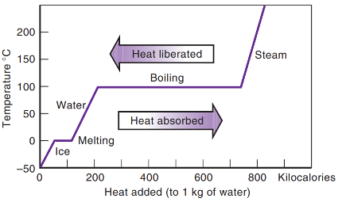

<head>

</head>

# Heat

**Heat:** Transfer of energy due to a difference in temperature

Types of heat — what is the result of the energy being transferred?

- **Specific heat:** Transfer of energy resulting in a change in temperature  
- **Latent heat:** Transfer of energy resulting in a change in the state of matter  

Reading:
* 5C-5F

Materials:
* Convection cycle tube, food coloring, food warmer/candle, matches

Activities:

## Specific Heat

- Depends on **mass** — more mass means more energy is needed to heat it up  
- Depends on the **material** — some materials require more energy to heat up  
- Specific heats of common substances (Table 4.2)

$$Q = mc\Delta T = mc(T_f - T_0)$$

> How much heat is required to raise the temperature of **7 gallons of water** from room temperature (70°F) to the boiling point (212°F)?
>
> - 1 gallon of water weighs 8.34 lb  
> 
> $$m = 7 \text{ gal} \times 8.34 \frac{\text{lb}}{\text{gal}} = 58.38 \text{ lb}$$
>
>
> $$Q = mc(T_f - T_0) = 58.38 \text{ lb} \times 1 \frac{\text{Btu}}{\text{lb °F}} \times (212 - 70)^\circ F$$
>
> $$Q = 8{,}389.96 \text{ Btu} \approx 8{,}745{,}908 \text{ J}$$

> How much heat must **25 kg of water** lose to cool from 16°C to 6°C?
>
> $$\Delta T = -10°C$$
>
> $$Q = mc(T_f - T_0) = 25 \text{ kg} \times 4186 \frac{\text{J}}{\text{kg °C}} \times (-10°C)$$
>
> $$Q = -1{,}046{,}500 \text{ J}$$

> If you apply **15,000 J** of heat to **8.0 kg of copper** $(c_{\text{Cu}} = 387 \text{ J/kg°C})$, how much does the temperature increase?
>
> $$\Delta T = \frac{Q}{mc} = \frac{15{,}000}{8.0 \times 387} = 4.8°C$$

## Latent Heat

- Sometimes heat is applied to **change the state of matter**
- When this happens, **temperature does not change**
- Depends on mass — more mass requires more energy

$$Q = mL$$

- **Heat of vaporization**: Energy absorbed to evaporate $(L_V)$  
  - Condensation releases energy $(-L_V)$ 
  - $L_V = 2260 \text{ kJ/kg}$ for water  

- **Heat of fusion**: Energy released to freeze $(-L_F)$  
  - Melting absorbs energy $(L_F)$  
  - $L_F = 335 \text{ kJ/kg}$ for water  

> How much heat is required to melt **5 kg of ice at 0°C**?
>
> $$Q = 5 \text{ kg} \times 335 \text{ kJ/kg} = 1675 \text{ kJ} = 1{,}675{,}000 \text{ J}$$

> How much heat is required to evaporate **5 kg of water at 100°C**?
>
> $$Q = 5 \text{ kg} \times 2260 \text{ kJ/kg} = 11{,}300 \text{ kJ} = 11{,}300{,}000 \text{ J}$$

## Heat vs. Temperature and State of Matter

*Figure 4.6 — Heat vs. Temperature and State of Matter for Water*

As heat is absorbed/released
* temperature increases/decreases due to specific heat, or 
* the substance changes to a higher/lower state of matter due to latent heat.

>Why do you feel cold when you get out of a pool?
> - Water on your skin begins to evaporate  
> - Evaporation requires energy (latent heat of vaporization)  
> - That energy comes from your skin  
> - As your skin loses energy, your temperature drops and you feel cold  
>
> 

> How much heat is required to **melt 5 kg of ice at 0°C**, **raise the temperature to 100°C**, and **evaporate it**?
> 1. Melt the ice
> 2. Raise the temperature
> 3. Evaporate the water 
> 4. Add them together to get the total
>
> 1. **Melt the ice**
>
> $$Q_1 = mL_F = 5 \times 335 \text{ kJ/kg} = 1{,}675{,}000 \text{ J}$$
>
> 2. **Raise the temperature**
>
> $$Q_2 = mc(T_f - T_i) = 5 \times 4186 \times (100 - 0) = 2{,}093{,}000 \text{ J} $$
>
> 3. **Evaporate the water**
>
> $$Q_3 = mL_V = 5 \times 2260 \text{ kJ/kg} = 11{,}300{,}000 \text{ J}$$
>
> 4. **Total energy**
>
> $$Q = Q_1 + Q_2 + Q_3 = 15{,}068{,}000 \text{ J}$$

**Question:** Which stage takes the most energy?

---

## Forms of Heat

How does heat occur? (That is, how is energy transferred?)

__Radiation__ is the transfer of energy moves through electromagnetic waves  
- Waves of electric and magnetic fields  
- Associated with photons  
- Examples: radio waves, microwaves, light, ultraviolet radiation, X‑rays  
- More on this later  

__Convection__ is the transfer of energy via the motion of a fluid  
- Example: Pot of soup — bottom heats up, warm fluid rises  

__Conduction__ is the transfer of energy from molecule to molecule  
- Example: Touching a hot object

## Conduction
__Conduction__ is the transfer of energy from molecule to molecule. Think of this like billiard balls hitting each other.

Some materials conduct heat faster than others. Factors that come into the rate of heat: 
- The **thermal conductivity** ($k$) is a value that indicates how quickly energy conducts through that material
    * A larger $k$ means a lot of energy is transfered 
- A larger __area__ ($A$) allows more energy to flow than a smaller area
- A larger __difference in temperatures__ ($T_f - T_0$) allows more heat to flow
- A larger __thickness__ ($x$) prevents heat from flowing as quickly

Putting these together, we get the full *Heat flow equation*.

$$\frac{Q}{t} = \frac{kA(T_f - T_i)}{x}$$

We often can't control the temperature or the area. But we can control both the thickness and the conductivity by choosing different substances. The ratio between the thickness and the thermal conductivity is known as the __R-Value__.

$$R = \frac{x}{k} \qquad \frac{Q}{t} = \frac{A}{R}(T_f - T_0)$$

- High \(R\) values → lower heat flow  
- Low \(R\) values → higher heat flow  

Ways to increase $R$:
- Increase thickness ($x$)  
- Decrease conductivity ($k$)  

Material comparisons:
- Metals and glass → high conductivity  
- Rock and wood → lower conductivity  
- Air and vacuum → extremely low conductivity  

This is why fiberglass, double‑pane windows, and wool sweaters are good insulators—they trap air.

> Fiberglass insulation has $k = 0.269 \tfrac{\text{ Btu}}{hr\cdot ft^2 \cdot \text{°F}}$.  What is the R‑value if it is **3.5 inches thick**?
>
> $$R = \frac{x}{k} = \frac{3.5}{0.269} = 13.01$$

Reference:  
[Fiberglass Insulation – engineeringtoolbox.com](https://www.engineeringtoolbox.com/fiberglas-insulation-k-values-d_1172.html)

Units:
- If $x$ is in meters, $k$ must be in $\tfrac{W}{m\cdot K}$ → RSI value  
- If $x$ is in inches, $k$ must be in $\tfrac{Btu\cdot in}{hr ft^2 °F}$

$$1.0 \tfrac{W}{m·K} = 6.935 \tfrac{Btu\cdot in}{hr ft^2 °F}$$

## Convection

**Convection** is the transfer of energy as a fluid flows, carrying the energy with it.

- Example: Pot of soup — warm water rises  

> Demo: Convection cycle  

- We’ll focus on convection cycles in buildings to improve energy efficiency in a future lecture

## Radiation

__Radiation__ is the transfer of energy through electromagnetic waves.

- A wave is a disturbance that propagates through space  
- Wave characteristics:
  - Wavelength (determines type of wave)
  - Frequency
  - Velocity  

Electromagnetic spectrum:
- Radio → Microwave → Infrared → Visible (Red–Violet) → UV → X‑rays → Gamma  

__Wave Equation__

$$v = \lambda f$$

__Speed of light__

$$v = 3.00 \times 10^8 \text{ m/s}$$

> Blue light has a wavelength of $\lambda = 500 \text{ nm}$. What is its frequency?
>
> $$f = \frac{v}{\lambda} = \frac{3*10^8 m/s}{500 nm} = \frac{300,000,000 m/s}{0.000000500 m} = 6 * 10^{14} \text{ Hz}$$

### Thermal Radiation
All objects emit radiation  
- The type of radiation depends on temperature  

[Interactive simulation: Blackbody Spectrum (PhET)](https://phet.colorado.edu/sims/html/blackbody-spectrum/latest/blackbody-spectrum_en.html)

Human body temperature ($~100^\circ F \approx 310 K$) indicates that we emit infrared radiation.  This is why infrared sensors work.

Examples:
- Earth: ~20°C → infrared radiation  
- Sun: ~6000°C → visible (green) light  

**Conduction, convection, and radiation** all occur simultaneously and together transfer energy.